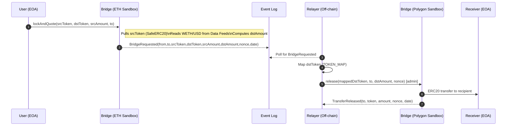
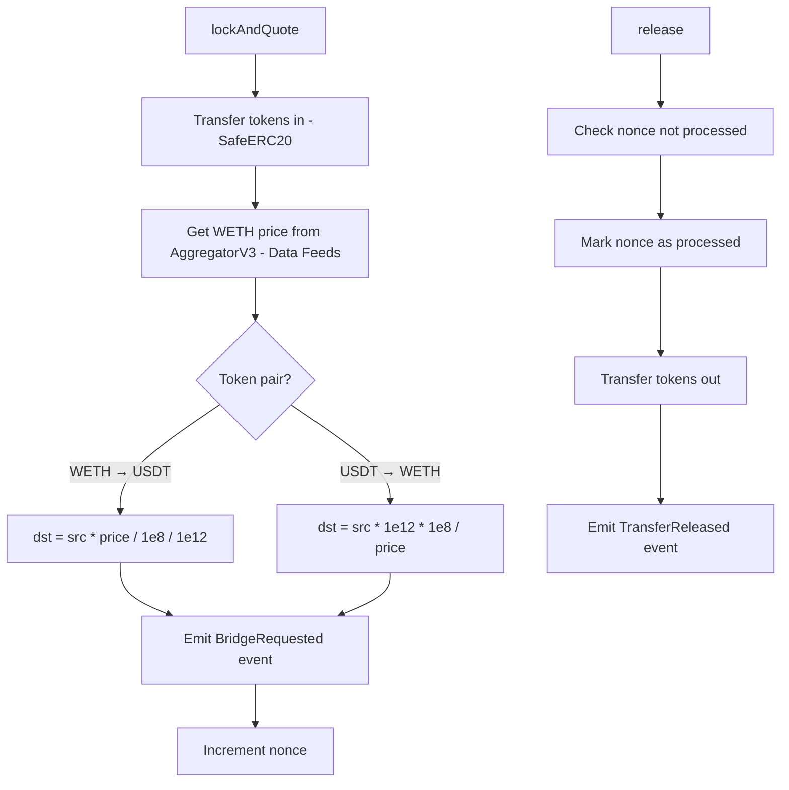

# Minimal Cross-Chain (WETH ⇄ USDT) Bridge with BuildBear Sandboxes and DataFeed Plugin

## Abstract

This project is a **naive but complete educational bridge** that simulates **mainnet-like behavior** end-to-end using **BuildBear’s Mainnet Sandboxes**:

- You’ll spin up **two BuildBear sandboxes**—one mirroring **Ethereum mainnet**, another mirroring **Polygon mainnet**.
- Each sandbox installs the **BuildBear Data Feeds plugin**, then you attach the **WETH/USD Chainlink feed** (same addresses as mainnet).
- Contracts are **verified via Sourcify** (BuildBear Sourcify plugin), and transactions can be **inspected with Sentio** (BuildBear Sentio plugin) to see exactly what happens under the hood.
- A **relayer** watches events on one chain and triggers releases on the other.

> **Why this matters:** Instead of mocking oracles and infrastructure, BuildBear lets you **test with real-world style addresses and interfaces** (feeds, tokens, explorers, debuggers) while keeping everything safe and fast in sandboxes. Perfect for demos, workshops, and educational content.

---

## How It Works (with Diagrams)

### High-Level Sequence



**Explanation:**

1. User calls `lockAndQuote` on **ETH sandbox** bridge. Contract pulls tokens in, reads Chainlink **WETH/USD** feed via the **Data Feeds plugin**, computes the destination amount, and emits a `BridgeRequested` event.
2. Relayer sees the event and calls `release` on the **Polygon sandbox** bridge, transferring the mapped token to the receiver. Nonces prevent double releases.

---

### Contract Internals



**Notes:**

- The Chainlink price is normalized to **1e8** inside `_getWethPrice()`.
- Decimal handling:

  - **WETH(18) → USDT(6):** `dst = src * price / 1e8 / 1e12`
  - **USDT(6) → WETH(18):** `dst = src * 1e12 * 1e8 / price`

---

## Features

- **Bridge.sol**: custody + quoting + events + secure `release` with nonce tracking.
- **Foundry scripts**: network config, deployment (with pre-funding), interaction.
- **Relayer (Node + ethers v6)**: event-driven **ETH → POL** release.
- **BuildBear First-Class:**

  - **Mainnet Sandboxes** for ETH & Polygon.
  - **Data Feeds plugin** (attach **WETH/USD**).
  - **Sourcify plugin** (one-click/CLI verify).
  - **Sentio plugin** for transaction debugging & tracing.

---

## Project Layout

```
.
├── src/
│   └── Bridge.sol
├── script/
│   ├── HelperConfig.s.sol
│   ├── DeployBridge.s.sol
│   └── InteractBridge.s.sol
├── relayer/
│   └── index.ts
├── lib/                # foundry dependencies
├── broadcast/          # forge script --broadcast outputs
├── package.json        # relayer deps & scripts
├── .env.example        # copy to .env and fill
├── Makefile
└── foundry.toml
```

---

## Prerequisites

- **Foundry** (forge, cast, anvil): [https://book.getfoundry.sh/](https://book.getfoundry.sh/)
- **Node.js** 18+ and **npm**
- **BuildBear account**

  - Create **two Mainnet Sandboxes**: one for **Ethereum**, one for **Polygon**.
  - Install plugins in **both** sandboxes:

    - **Data Feeds** → add **WETH/USD** feed.
    - **Sourcify** (for contract verification).
    - **Sentio** (for transaction debugging).

> BuildBear sandboxes mirror mainnet contract addresses (e.g., WETH/USDT, Chainlink feeds), giving you realistic addresses and interfaces without the risks of real mainnet.

---

## Environment Setup

Copy `.env.example` → `.env`.
We’ve prefilled the **mainnet-equivalent addresses** for WETH/USDT and WETH/USD feeds to save time.

```ini
# RPC endpoints (your BuildBear sandbox RPC URLs)
ETH_MAINNET_SANDBOX=
POL_MAINNET_SANDBOX=

# Deployer/admin key & address
PRIVATE_KEY=
WALLET_ADDRESS=

# Chainlink WETH/USD feeds (mainnet addresses)
MAINNET_FEED_WETH_USD=0x5f4eC3Df9cbd43714FE2740f5E3616155c5b8419
POLYGON_FEED_WETH_USD=0xF9680D99D6C9589e2a93a78A04A279e509205945

# Token addresses (mainnet addresses; mirrored in BuildBear sandboxes)
ETH_WETH_TOKEN=0xc02aaa39b223fe8d0a0e5c4f27ead9083c756cc2
ETH_USDT_TOKEN=0xdAC17F958D2ee523a2206206994597C13D831ec7
POL_WETH_TOKEN=0x7ceb23fd6bc0add59e62ac25578270cff1b9f619
POL_USDT_TOKEN=0xc2132D05D31c914a87C6611C10748AEb04B58e8F

# EOA used to perform lockAndQuote
RECEIVER_WALLET=
RECEIVER_PRIVATE_KEY=
```

> **Need a new wallet?**
> Generate one with Foundry:
>
> ```bash
> cast wallet new
> ```
>
> You’ll get a fresh **private key** and **address** for `.env`.

### `foundry.toml` RPC aliases (example)

```toml
[rpc_endpoints]
eth_mainnet_sandbox = "${ETH_MAINNET_SANDBOX}"
pol_mainnet_sandbox = "${POL_MAINNET_SANDBOX}"
```

---

## Install & Build

Make sure your **Makefile** includes:

```Makefile
.PHONY: make-deploy

install:
\tforge install && npm i && forge build
```

Run:

```bash
make install
```

This installs Foundry deps, Node deps, and builds the contracts.

---

## Deploy (with Sourcify verification)

Your Makefile targets (keep as provided):

```Makefile
deploy-mainnet-sourcify:
\tforge script script/DeployBridge.s.sol \
\t --rpc-url eth_mainnet_sandbox \
\t --verifier sourcify \
\t --verify \
\t --verifier-url https://rpc.buildbear.io/verify/sourcify/server/eth-to-pol \
\t --broadcast \

deploy-pol-sourcify:
\tforge script script/DeployBridge.s.sol \
\t --rpc-url pol_mainnet_sandbox \
\t --verifier sourcify \
\t --verify \
\t --verifier-url https://rpc.buildbear.io/verify/sourcify/server/pol-to-eth \
\t --broadcast \
```

**Pre-funding check (in `DeployBridge.s.sol`):**

- `WALLET_ADDRESS` must hold **> 1000 WETH (18)** and **> 25,000 USDT (6)** in each sandbox for liquidity transfer to the bridge.
- Adjust/remove requires if you want to demo with smaller amounts.

---

## Interact (Lock & Quote)

Make targets:

```Makefile
interact-mainnet-bridge:
\tforge script script/InteractBridge.s.sol \
\t --rpc-url eth_mainnet_sandbox \
\t --broadcast \

interact-pol-bridge:
\tforge script script/InteractBridge.s.sol \
\t --rpc-url pol_mainnet_sandbox \
\t --broadcast \
```

> If your file still points `interact-pol-bridge` at the ETH RPC, switch it to `pol_mainnet_sandbox` as above.

What happens:

- Script loads the last deployed bridge address from `broadcast/DeployBridge.s.sol/<chainId>/run-latest.json`.
- Uses `RECEIVER_PRIVATE_KEY` to approve and call `lockAndQuote` (default `1e18` WETH).
- Emits `BridgeRequested` with computed `dstAmount`.

---

## Relayer

`package.json` (example):

```json
{
  "scripts": {
    "relayer": "tsx relayer/index.ts"
  },
  "dependencies": {
    "dotenv": "^16.4.5",
    "ethers": "^6.12.0",
    "tsx": "^4.16.2"
  }
}
```

Run:

```bash
npm run relayer
```

Relayer behavior:

- Reads latest ETH/POL bridge addresses from `broadcast/*/run-latest.json`.
- Subscribes/polls for `BridgeRequested` on ETH sandbox.
- Maps tokens (using `TOKEN_MAP`) and calls `release()` on POL sandbox with the **admin** key.

Expected console:

```
ETH Bridge: 0x...
POL Bridge: 0x...
Relayer started. Watching new events...
Detected BridgeRequested: { ... }
Release tx sent: 0x<hash>
Release confirmed.
```

---

## Debugging & Verification in BuildBear

- **Sourcify plugin**: Contracts are verified automatically using the configured `--verifier-url`. You can browse verified source in the sandbox explorer.
- **Sentio plugin**: Open your sandbox’s Sentio view to:

  - Trace `lockAndQuote` and `release`
  - Inspect token transfers and event logs
  - Confirm nonce usage and balances

> This is where BuildBear shines: **click into traces and logs** for a mainnet-like flow—no mocks, no guesswork.

---

## Troubleshooting

- **No events detected by relayer**

  - Confirm `BridgeRequested` topic signature matches exactly.
  - Ensure you are calling `lockAndQuote` on the same sandbox the relayer is watching.
  - Check `lastProcessed` block logic and RPC indexing.

- **“Not admin” on `release()`**

  - The relayer wallet **must be the `admin`** (bridge deployer) on the **destination** sandbox.

- **Amounts look off**

  - Verify addresses for WETH/USDT and feeds. WETH is **18 decimals**, USDT **6**.
  - Feed returns are normalized to **1e8** inside `_getWethPrice()`.

- **Liquidity errors**

  - Pre-funding requires balances on `WALLET_ADDRESS` in both sandboxes (WETH, USDT). Adjust the thresholds if needed.

- **Approvals**

  - Ensure the interacting EOA (receiver) approves the bridge for the correct token and amount **before** calling `lockAndQuote`.

---

## Limitations & Next Steps

This is a **trusted** bridge built for educational purposes:

- Single trusted relayer (no quorum/multi-sig).
- No cryptographic proofs / light clients / finality checks.
- No slashing, fraud proofs, or MEV mitigation.
- Simple nonce replay protection.

**Ideas to extend:**

- Threshold/multi-sig relayers or optimistic verification.
- Per-pair fees, slippage guards, and liquidity accounting.
- Support more tokens and feeds; price oracles per token.
- Timeout and refund flows; reorg-aware relayer.
